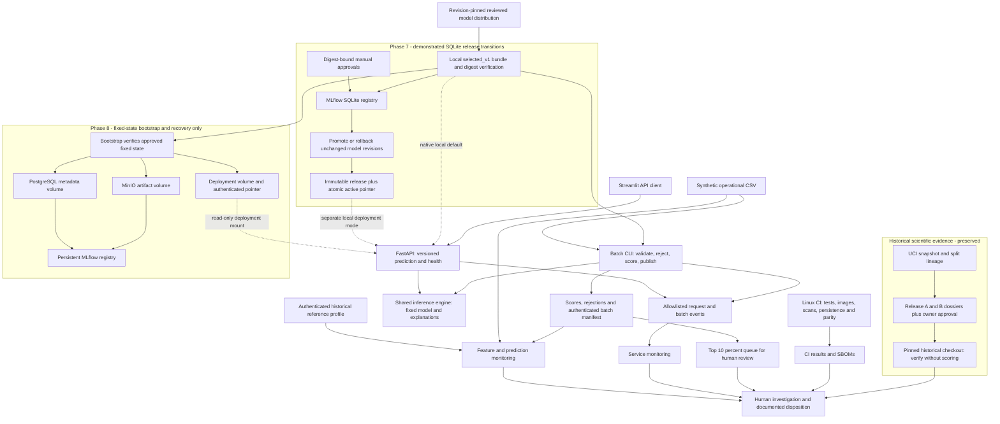

# Implemented local architecture

**Status:** Week 11 communication candidate. The arrows below describe existing
code and frozen evidence, not an expanded release or cloud deployment.

## Component-to-implementation map

| Concern | Implemented authority | Boundary |
| --- | --- | --- |
| Historical science and approval | [Release A dossier](../../reports/releases/release_a_v1/release-a-report.md), [Release B approval](../../configs/releases/release_b_owner_approval_v1.json), [historical verifier](../../.github/workflows/release-b-evidence.yml) | Verify the original checkout with fixed digest anchors; later source changes are tested separately. |
| Model distribution | [Artifact workflow](../../src/credit_risk/artifact_distribution/workflow.py), [model manifest](../../models/selected_v1/manifest.json) | Distribution supplies exact bytes; it neither promotes a model nor gives runtime loaders network access. |
| Inference and batch policy | [Shared engine](../../src/credit_risk/inference/engine.py), [batch workflow](../../src/credit_risk/inference/batch.py), [frozen contract](../../configs/inference/phase6_v1.json) | Fixed predictors, identity calibration, risk bands and review policy. API has no portfolio ranking context. |
| API and UI | [API application](../../src/credit_risk/inference/api.py), [Streamlit client](../../app.py) | Native Windows processes for the live walkthrough; containers are independently exercised on Linux. |
| Phase 7 transitions | [Registry workflow](../../src/credit_risk/registry/workflow.py), [approved registry evidence](../../reports/registry/phase7_v1/registry-release-report.md) | SQLite demonstrates promotion and rollback between revisions of identical model bytes. |
| Phase 8 persistence | [Compose stack](../../docker-compose.platform.yml), [bootstrap](../../src/credit_risk/platform/bootstrap.py), [platform protocol](../platform/phase8-protocol.md) | PostgreSQL, MinIO and deployment volumes support fixed-state bootstrap, verification and restart recovery. No PostgreSQL promotion/rollback claim. |
| Monitoring and incidents | [Monitoring workflow](../../src/credit_risk/monitoring/workflow.py), [incident runner](../../src/credit_risk/incidents/workflow.py), [runbooks](../operations/release-b-runbooks.md) | Alerts prompt investigation; no automatic retraining, threshold change or promotion. |
| Delivery controls | [Linux CI](../../.github/workflows/ci.yml), [source storage guide](../artifacts/storage-architecture.md) | Existing tests, branch coverage, image scans and SBOMs; row-level data and runtime credentials stay outside Git. |

The two registry subgraphs are separate demonstrations. There is no migration or
runtime transition arrow between their databases. The native demo reads the
verified local bundle; it does not pretend that local Windows services reproduce
the full Docker stack. The API/UI and batch scores are technical demonstrations,
not lending approval, causal explanations or autonomous customer decisions.

## Conceptual cloud mapping

| Local component | Conceptual Azure/Databricks analogue |
| --- | --- |
| Python batch task | Databricks Jobs / Workflows |
| Local files and MinIO | ADLS Gen2 and Delta tables |
| MLflow tracking and aliases | Managed MLflow and Unity Catalog models |
| FastAPI container | Azure Container Apps or managed serving |
| CLI reports and safe events | Lakehouse Monitoring / Azure Monitor patterns |

These are interview mappings only. No Azure resources, Spark pipeline, cloud
model registry or managed monitoring deployment is implemented by this project.
